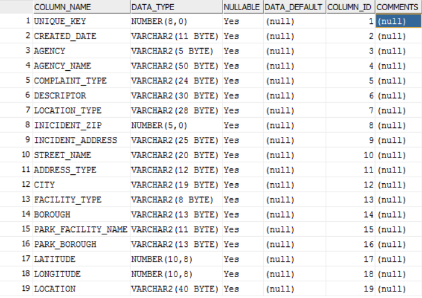
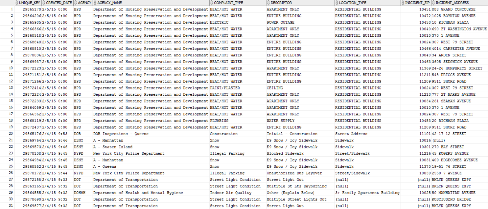

Project 2 required Jeffrey and I to import a large dataset into Oracle Server and call the data into RStudio for analysis. Below will describe the dataset and the following analysis. 

Dataset: Jcn565_311Calls

Oracle SQL Developer: C##CS329E_JCN565

Rows: 1804 observations

JCN565_311Calls is a collection of 311 Calls in New York City. 311 Call systems traditionally have been used to report incidents where the immediate presence of a police officer is not required, examples such as quality-of-life problems. The dataset will contain the dates, location, office of contact, complaint type, etc.of the 311 call.



__Figure 1. Table Variables__

Figure 1 displays the table variables used for this project.


__1. Loading of R packages: RCurl, ggplot2, dplyr, tidyr (R code not shown)__

```{r, include=FALSE}
library(RCurl)
library (ggplot2)
require(dplyr)
require(tidyr)

```

__2. Call for JCN565_311Calls from the SQL Server using a data frame query__

```{r}
source("../01 Data/data_frame_orcl.R", echo = TRUE)
```


__Figure 2. Sample of dataset JCN565_311Calls__

Figure 2 showcases a sample set of the dataset that we used for analysis. Please note the missing variables to the right of the figure. Below shows a simple breakdown of the complaint types grouped by the NYC Boroughs. This gives us a better idea of request/complaints by location.

``` {r}
source('../02 Data Wrangling/DR5.R',echo = TRUE)

```

__3. Analysis of JCN565_311Calls__
```{r, warning = FALSE}
source ('../03 Visualization/plot NYC.R', echo = TRUE)
```

Coorindate points (Longitude and Longitude) from callers were documented and was used to help visualize the boroughs within New York City. The visual above was created for that purpose.


```{r}
source('../03 Visualization/plotagency.R', echo = TRUE)
```

Graph above breaks down which agency receives the most 311 calls.

```{r}
source('../03 Visualization/complaint.R', echo = TRUE)
```

You are able to see that Department of Housing Preservation and Development (HPD) receives the most complaints. From there, we analyzed to see what complaint types were most profound within HPD. We know overall HEAT/HOT WATER problem is most severe and would want to know in which borough is affected the most. Data frame #1 is imported, which is a dataset that contains information (zip code, borough, location, etc.) about the HEAT/HOT WATER problem. 

Overall HEAT/HOT WATER breakdown:
(data imported from data frame #1)
```{r}
source ('../01 Data/df1.R')
tbl_df(df1)
source('../02 Data Wrangling/DR1.R',echo = T)
```

Now we know BRONX, BROOKLYN, and NEW YORK has much more complaints than other boroughs. We will now focus on these three boroughs to see which specific area in each borough is most severe based on zipcode, it is better to represent each city through a histogram. 

For BRONX:
(data imported from data frame #2)
```{r}
source ('../01 Data/df2.R')
tbl_df(df2)
View(df2) 
source('../02 Data Wrangling/DR2.R',echo = T)
```

For BROOKLYN:
(data imported from data frame #3)
```{r}
source ('../01 Data/df3.R')
tbl_df(df3)
source('../02 Data Wrangling/DR3.R',echo = T)
```

For NEW YORK:
(data imported from data frame #4)
```{r}
source ('../01 Data/df4.R')
tbl_df(df4)

source('../02 Data Wrangling/DR4.R',echo = T)

```

By having this data, it can be used to help the city determine specific locations within NYC to be addressed first due to the amount of incoming 311 Calls. It can also be used to determine where to allocate city money in order to better the city and fully understand what issues occur in different boroughs.