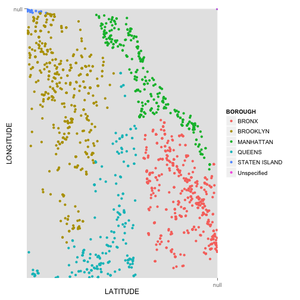
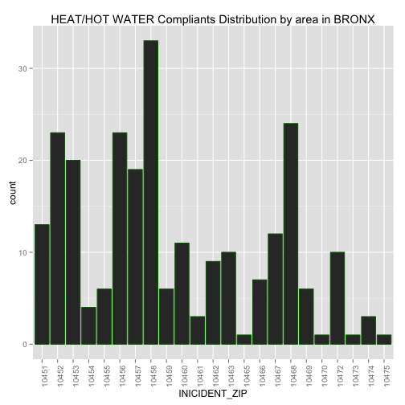
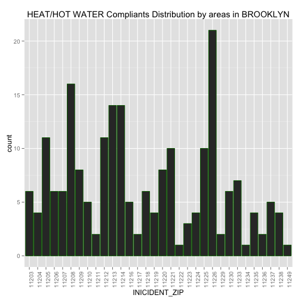
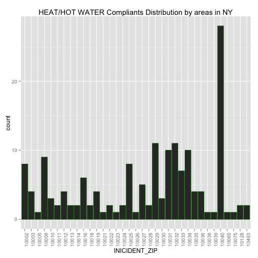

Project 2 required Jeffrey and I to import a large data set onto Oracle Server and call the data into RStudio to analyze. 

Dataset: Jcn565-311Calls

DeScrIBE DATA 

__Loading of necessary R packages: RCurl, ggplot2 (R code not shown)__


```r
source("../01 Data/data_frame_orcl.R", echo = TRUE)
```

```
## 
## > library(ggplot2)
## 
## > df <- data.frame(eval(parse(text = substring(getURL(URLencode("http://129.152.144.84:5001/rest/native/?query=\"select * from JCN565_311Calls\""), 
## + .... [TRUNCATED] 
## 
## > head(df)
##   UNIQUE_KEY CREATED_DATE AGENCY
## 1   29865170  2/5/15 0:00    HPD
## 2   29864206  2/5/15 0:00    HPD
## 3   29865935  2/5/15 0:00    HPD
## 4   29866366  2/5/15 0:00    HPD
## 5   29868518  2/5/15 0:00    HPD
## 6   29868840  2/5/15 0:00    HPD
##                                          AGENCY_NAME COMPLAINT_TYPE
## 1 Department of Housing Preservation and Development HEAT/HOT WATER
## 2 Department of Housing Preservation and Development HEAT/HOT WATER
## 3 Department of Housing Preservation and Development       ELECTRIC
## 4 Department of Housing Preservation and Development HEAT/HOT WATER
## 5 Department of Housing Preservation and Development HEAT/HOT WATER
## 6 Department of Housing Preservation and Development HEAT/HOT WATER
##        DESCRIPTOR        LOCATION_TYPE INICIDENT_ZIP
## 1  APARTMENT ONLY RESIDENTIAL BUILDING         10451
## 2 ENTIRE BUILDING RESIDENTIAL BUILDING         10472
## 3    POWER OUTAGE RESIDENTIAL BUILDING         10453
## 4  APARTMENT ONLY RESIDENTIAL BUILDING         10040
## 5  APARTMENT ONLY RESIDENTIAL BUILDING         10010
## 6 ENTIRE BUILDING RESIDENTIAL BUILDING         10024
##           INCIDENT_ADDRESS          STREET_NAME ADDRESS_TYPE     CITY
## 1      888 GRAND CONCOURSE      GRAND CONCOURSE      ADDRESS    BRONX
## 2      1025 BOYNTON AVENUE       BOYNTON AVENUE      ADDRESS    BRONX
## 3         10 RICHMAN PLAZA        RICHMAN PLAZA      ADDRESS    BRONX
## 4 690 FT WASHINGTON AVENUE FT WASHINGTON AVENUE      ADDRESS NEW YORK
## 5             370 1 AVENUE             1 AVENUE      ADDRESS NEW YORK
## 6       307 WEST 79 STREET       WEST 79 STREET      ADDRESS NEW YORK
##   FACILITY_TYPE   BOROUGH PARK_FACILITY_NAME PARK_BOROUGH         LATITUDE
## 1           N/A     BRONX        Unspecified        BRONX 40.8265228271484
## 2           N/A     BRONX        Unspecified        BRONX 40.8245964050293
## 3           N/A     BRONX        Unspecified        BRONX 40.8516616821289
## 4           N/A MANHATTAN        Unspecified    MANHATTAN  40.857349395752
## 5           N/A MANHATTAN        Unspecified    MANHATTAN 40.7360687255859
## 6           N/A MANHATTAN        Unspecified    MANHATTAN  40.784481048584
##           LONGITUDE                                 LOCATION
## 1 -73.9228134155273 (40.826522345603735, -73.92281608727372)
## 2 -73.8772964477539  (40.824594531459304, -73.8772991398564)
## 3 -73.9228057861328  (40.85166114246705, -73.92280860415683)
## 4  -73.935417175293  (40.85735042331317, -73.93541468530225)
## 5 -73.9789657592773  (40.73606882164155, -73.97896661143264)
## 6    -73.9814453125 (40.784481034378544, -73.98144292739936)
```

You can also embed plots, for example:


```r
ggplot(df, aes(x = LATITUDE, y = LONGITUDE, color = BOROUGH)) + geom_point() +  scale_y_discrete(breaks=df$LATITUDE) + scale_x_discrete(breaks=df$LONGITUDE)
```

 

```r
ggplot(data = df) + geom_histogram(aes(x = AGENCY)) + ggtitle("311 Calls to Different Types of Agencies")
```

 

```r
complaint <- subset(df, AGENCY == "HPD", select = c(COMPLAINT_TYPE))
View(complaint)
ggplot (data = complaint, main = "HPD Complaint Breakdown") + geom_histogram(aes(x = COMPLAINT_TYPE)) + theme(axis.text.x = element_text(angle = 90, hjust = 1)) + ggtitle("HPD Complaint Breakdown")
```

 


```r
# From graph above, we know overall HEAT/HOT WATER problem is most severe, now we want to know in which citys this problem is most significant
# import df1 in Data Folder, which is a df containging all info about HEAT/HOT WATER problem
source ('../01 Data/df1.R')
tbl_df(df1)
```

```
## Source: local data frame [722 x 3]
## 
##    COMPLAINT_TYPE          CITY INICIDENT_ZIP
## 1  HEAT/HOT WATER         BRONX         10451
## 2  HEAT/HOT WATER         BRONX         10472
## 3  HEAT/HOT WATER      NEW YORK         10040
## 4  HEAT/HOT WATER      NEW YORK         10010
## 5  HEAT/HOT WATER      NEW YORK         10024
## 6  HEAT/HOT WATER         BRONX         10466
## 7  HEAT/HOT WATER      NEW YORK         10040
## 8  HEAT/HOT WATER         BRONX         10463
## 9  HEAT/HOT WATER East Elmhurst         11369
## 10 HEAT/HOT WATER      BROOKLYN         11211
## ..            ...           ...           ...
```

```r
# plot
source('../02 Data Wrangling/DR1.R',echo = T)
```

```
## 
## > df1 %>% ggplot(aes(x = factor(CITY), fill = factor(INICIDENT_ZIP))) + 
## +     geom_bar(width = 1) + theme(axis.text.x = element_text(angle = 90, 
## +   .... [TRUNCATED]
```

 

```r
# Now we know, in BRONX,BROOKLYN and NEW YORK, there are much more complaints than other citis
# So we will focus on these three cities to see which areas are most severe in each city
# since there are too many zipcodes, it is better to represent them by each city and use the histgram

# For BRONX
# import df2
source ('../01 Data/df2.R')
tbl_df(df2)
```

```
## Source: local data frame [246 x 2]
## 
##     CITY INICIDENT_ZIP
## 1  BRONX         10451
## 2  BRONX         10472
## 3  BRONX         10466
## 4  BRONX         10463
## 5  BRONX         10472
## 6  BRONX         10451
## 7  BRONX         10468
## 8  BRONX         10458
## 9  BRONX         10453
## 10 BRONX         10452
## ..   ...           ...
```

```r
#plot 
source('../02 Data Wrangling/DR2.R',echo = T)
```

```
## 
## > ggplot(df2) + geom_histogram(colour = "darkgreen", 
## +     aes(x = INICIDENT_ZIP)) + labs(title = "HEAT/HOT WATER Compliants Distribution by area in  ..." ... [TRUNCATED]
```

 

```r
# For BROOKLYN import df3
source ('../01 Data/df3.R')
tbl_df(df3)
```

```
## Source: local data frame [209 x 2]
## 
##        CITY INICIDENT_ZIP
## 1  BROOKLYN         11211
## 2  BROOKLYN         11209
## 3  BROOKLYN         11213
## 4  BROOKLYN         11209
## 5  BROOKLYN         11214
## 6  BROOKLYN         11214
## 7  BROOKLYN         11221
## 8  BROOKLYN         11226
## 9  BROOKLYN         11218
## 10 BROOKLYN         11225
## ..      ...           ...
```

```r
# plot 
source('../02 Data Wrangling/DR3.R',echo = T)
```

```
## 
## > ggplot(df3) + geom_histogram(colour = "darkgreen", 
## +     aes(x = INICIDENT_ZIP)) + labs(title = "HEAT/HOT WATER Compliants Distribution by areas in ..." ... [TRUNCATED]
```

 

```r
# For NEW YORK import df4
source ('../01 Data/df4.R')
tbl_df(df4)
```

```
## Source: local data frame [165 x 2]
## 
##        CITY INICIDENT_ZIP
## 1  NEW YORK         10040
## 2  NEW YORK         10010
## 3  NEW YORK         10024
## 4  NEW YORK         10040
## 5  NEW YORK         10034
## 6  NEW YORK         10010
## 7  NEW YORK         10024
## 8  NEW YORK         10033
## 9  NEW YORK         10012
## 10 NEW YORK         10034
## ..      ...           ...
```

```r
# plot 
source('../02 Data Wrangling/DR4.R',echo = T)
```

```
## 
## > ggplot(df4) + geom_histogram(colour = "darkgreen", 
## +     aes(x = INICIDENT_ZIP)) + labs(title = "HEAT/HOT WATER Compliants Distribution by areas in ..." ... [TRUNCATED]
```

 
