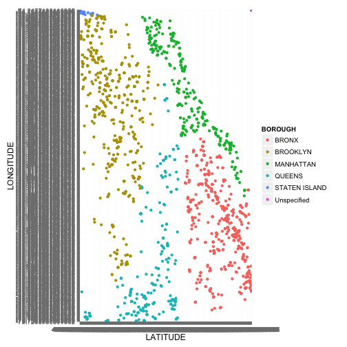
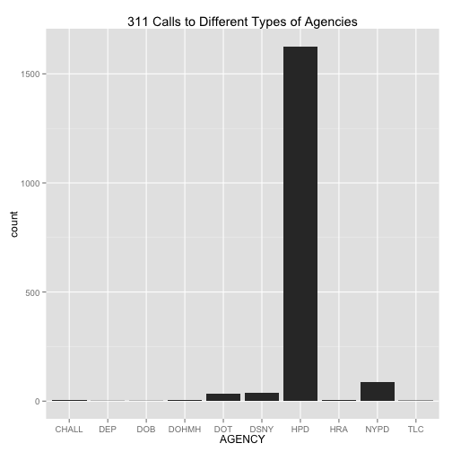
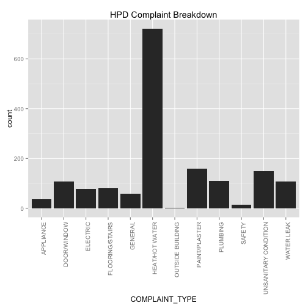
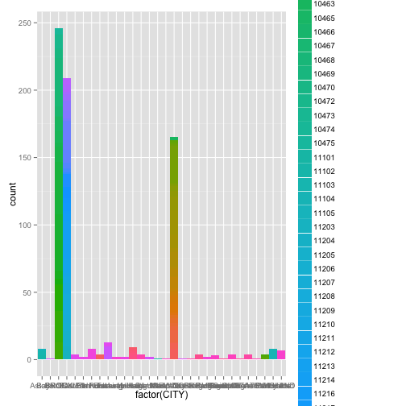
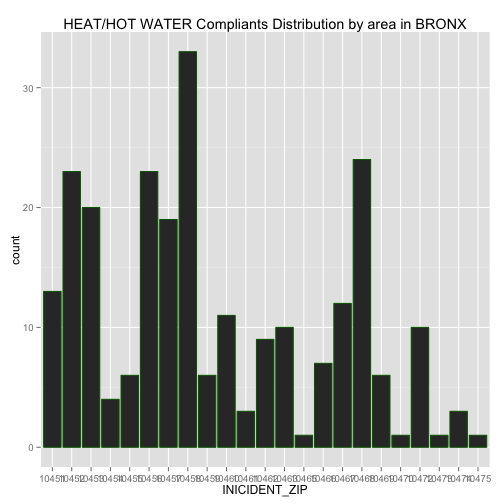

Project 2 required Jeffrey and I to import a large data set onto Oracle Server and call the data into RStudio to analyze. 

Dataset: Jcn565-311Calls

__Loading of necessary R packages: RCurl, ggplot2 (R code not shown)__


```r
source("../01 Data/data_frame_orcl.R", echo = TRUE)
```

```
## 
## > library(ggplot2)
## 
## > df <- data.frame(eval(parse(text = substring(getURL(URLencode("http://129.152.144.84:5001/rest/native/?query=\"select * from JCN565_311Calls\""), 
## + .... [TRUNCATED] 
## 
## > head(df)
##   UNIQUE_KEY CREATED_DATE AGENCY
## 1   29865170  2/5/15 0:00    HPD
## 2   29864206  2/5/15 0:00    HPD
## 3   29865935  2/5/15 0:00    HPD
## 4   29866366  2/5/15 0:00    HPD
## 5   29868518  2/5/15 0:00    HPD
## 6   29868840  2/5/15 0:00    HPD
##                                          AGENCY_NAME COMPLAINT_TYPE
## 1 Department of Housing Preservation and Development HEAT/HOT WATER
## 2 Department of Housing Preservation and Development HEAT/HOT WATER
## 3 Department of Housing Preservation and Development       ELECTRIC
## 4 Department of Housing Preservation and Development HEAT/HOT WATER
## 5 Department of Housing Preservation and Development HEAT/HOT WATER
## 6 Department of Housing Preservation and Development HEAT/HOT WATER
##        DESCRIPTOR        LOCATION_TYPE INICIDENT_ZIP
## 1  APARTMENT ONLY RESIDENTIAL BUILDING         10451
## 2 ENTIRE BUILDING RESIDENTIAL BUILDING         10472
## 3    POWER OUTAGE RESIDENTIAL BUILDING         10453
## 4  APARTMENT ONLY RESIDENTIAL BUILDING         10040
## 5  APARTMENT ONLY RESIDENTIAL BUILDING         10010
## 6 ENTIRE BUILDING RESIDENTIAL BUILDING         10024
##           INCIDENT_ADDRESS          STREET_NAME ADDRESS_TYPE     CITY
## 1      888 GRAND CONCOURSE      GRAND CONCOURSE      ADDRESS    BRONX
## 2      1025 BOYNTON AVENUE       BOYNTON AVENUE      ADDRESS    BRONX
## 3         10 RICHMAN PLAZA        RICHMAN PLAZA      ADDRESS    BRONX
## 4 690 FT WASHINGTON AVENUE FT WASHINGTON AVENUE      ADDRESS NEW YORK
## 5             370 1 AVENUE             1 AVENUE      ADDRESS NEW YORK
## 6       307 WEST 79 STREET       WEST 79 STREET      ADDRESS NEW YORK
##   FACILITY_TYPE   BOROUGH PARK_FACILITY_NAME PARK_BOROUGH         LATITUDE
## 1           N/A     BRONX        Unspecified        BRONX 40.8265228271484
## 2           N/A     BRONX        Unspecified        BRONX 40.8245964050293
## 3           N/A     BRONX        Unspecified        BRONX 40.8516616821289
## 4           N/A MANHATTAN        Unspecified    MANHATTAN  40.857349395752
## 5           N/A MANHATTAN        Unspecified    MANHATTAN 40.7360687255859
## 6           N/A MANHATTAN        Unspecified    MANHATTAN  40.784481048584
##           LONGITUDE                                 LOCATION
## 1 -73.9228134155273 (40.826522345603735, -73.92281608727372)
## 2 -73.8772964477539  (40.824594531459304, -73.8772991398564)
## 3 -73.9228057861328  (40.85166114246705, -73.92280860415683)
## 4  -73.935417175293  (40.85735042331317, -73.93541468530225)
## 5 -73.9789657592773  (40.73606882164155, -73.97896661143264)
## 6    -73.9814453125 (40.784481034378544, -73.98144292739936)
```

You can also embed plots, for example:


```r
ggplot(df, aes(x = LATITUDE, y = LONGITUDE, color = BOROUGH)) + geom_point() +  scale_x_discrete(breaks=df$LATITUDE)
```

 

```r
ggplot(data = df) + geom_histogram(aes(x = AGENCY)) + ggtitle("311 Calls to Different Types of Agencies")
```

 

```r
complaint <- subset(df, AGENCY == "HPD", select = c(COMPLAINT_TYPE))
View(complaint)
ggplot (data = complaint, main = "HPD Complaint Breakdown") + geom_histogram(aes(x = COMPLAINT_TYPE)) + theme(axis.text.x = element_text(angle = 90, hjust = 1)) + ggtitle("HPD Complaint Breakdown")
```

 

```r
require(dplyr)
```

```
## Loading required package: dplyr
## 
## Attaching package: 'dplyr'
## 
## The following objects are masked from 'package:stats':
## 
##     filter, lag
## 
## The following objects are masked from 'package:base':
## 
##     intersect, setdiff, setequal, union
```

```r
require(tidyr)
```

```
## Loading required package: tidyr
```

```
## Warning in library(package, lib.loc = lib.loc, character.only = TRUE,
## logical.return = TRUE, : there is no package called 'tidyr'
```

```r
tbl_df(df)
```

```
## Source: local data frame [1,804 x 19]
## 
##    UNIQUE_KEY CREATED_DATE AGENCY
## 1    29865170  2/5/15 0:00    HPD
## 2    29864206  2/5/15 0:00    HPD
## 3    29865935  2/5/15 0:00    HPD
## 4    29866366  2/5/15 0:00    HPD
## 5    29868518  2/5/15 0:00    HPD
## 6    29868840  2/5/15 0:00    HPD
## 7    29868810  2/5/15 0:00    HPD
## 8    29870036  2/5/15 0:00    HPD
## 9    29869937  2/5/15 0:00    HPD
## 10   29872123  2/5/15 0:00    HPD
## ..        ...          ...    ...
## Variables not shown: AGENCY_NAME (fctr), COMPLAINT_TYPE (fctr), DESCRIPTOR
##   (fctr), LOCATION_TYPE (fctr), INICIDENT_ZIP (fctr), INCIDENT_ADDRESS
##   (fctr), STREET_NAME (fctr), ADDRESS_TYPE (fctr), CITY (fctr),
##   FACILITY_TYPE (fctr), BOROUGH (fctr), PARK_FACILITY_NAME (fctr),
##   PARK_BOROUGH (fctr), LATITUDE (fctr), LONGITUDE (fctr), LOCATION (fctr)
```

```r
#df %>% select(ADDRESS_TYPE, BOROUGH) %>% filter(ADDRESS_TPYE == "ADDRESS") %>% tbl_df
```


```r
#from above plot, we know in HPD Dept, HEAT/HOT WATER is the most severe problem in these cities on average. Now we are curious about in which citys they have more compliants and which areas (by zipcode) in those cities have most complaints
 
df2 <- df %>% select(COMPLAINT_TYPE,CITY,INICIDENT_ZIP) %>% filter(COMPLAINT_TYPE %in% 'HEAT/HOT WATER')
ggplot(df2, aes(x = factor(CITY), fill = factor(INICIDENT_ZIP))) + geom_bar(width = 1)
```

 

```r
# from the graph, we know in city BRONX,BROOKLYN and NEW YORK, there are much more complaints than other citis.
# so we will focus on these three cities to see which area is most severe in each city
# since there are too many zipcodes, it is better to represent them by each city and use the histgram
# for BRONX
df3 <- df2 %>% select(CITY,INICIDENT_ZIP) %>% filter(CITY %in% 'BRONX')
ggplot(df3) + geom_histogram(colour='darkgreen',aes(x=INICIDENT_ZIP)) + labs(title='HEAT/HOT WATER Compliants Distribution by area in BRONX')
```

 

```r
# we can do same for BROOKLYN and NEW YORK
```
